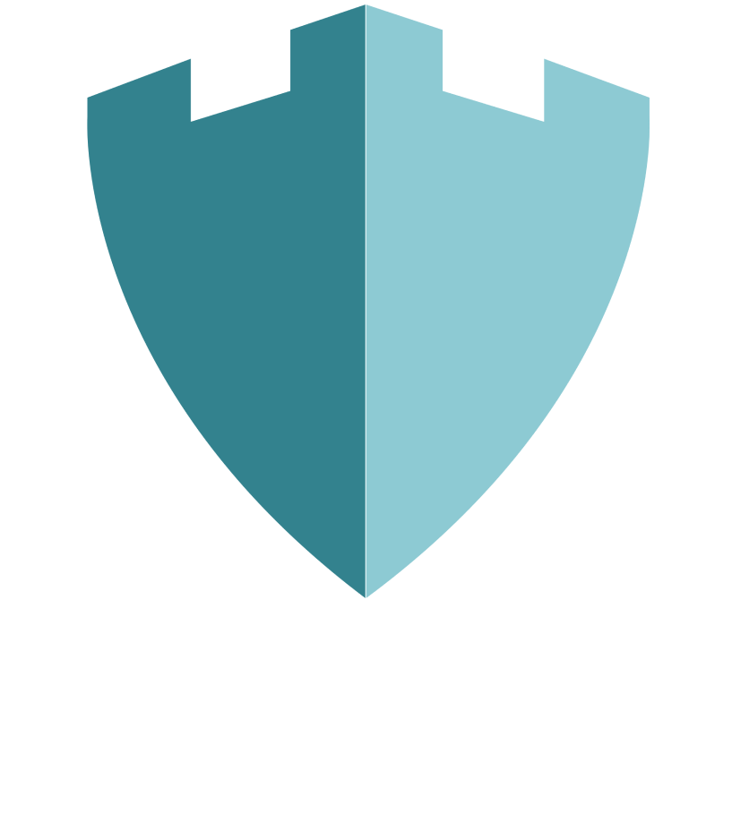
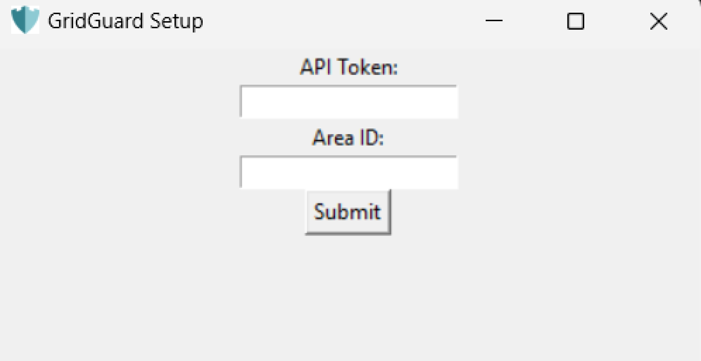
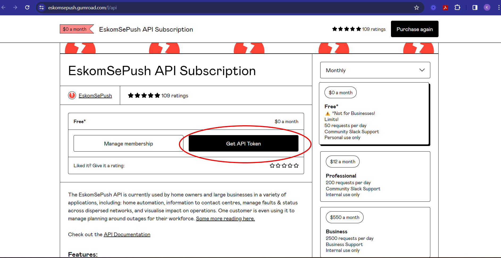
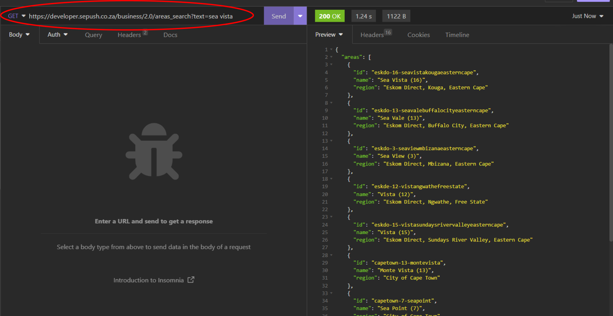
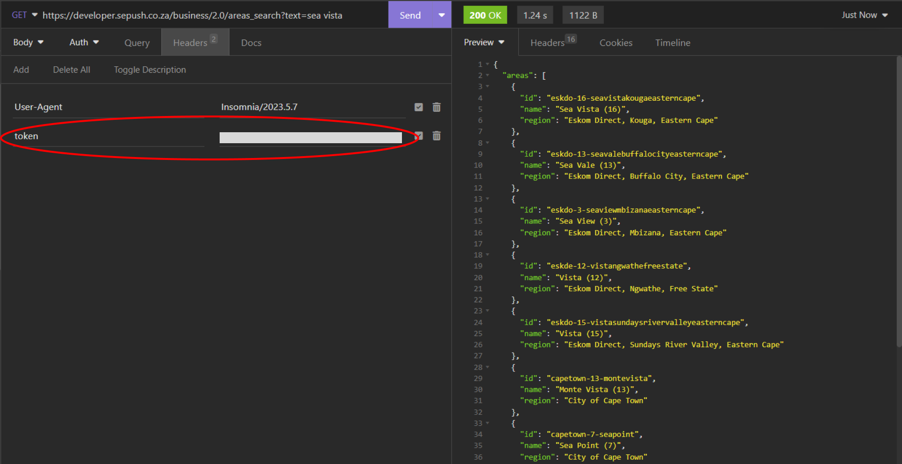
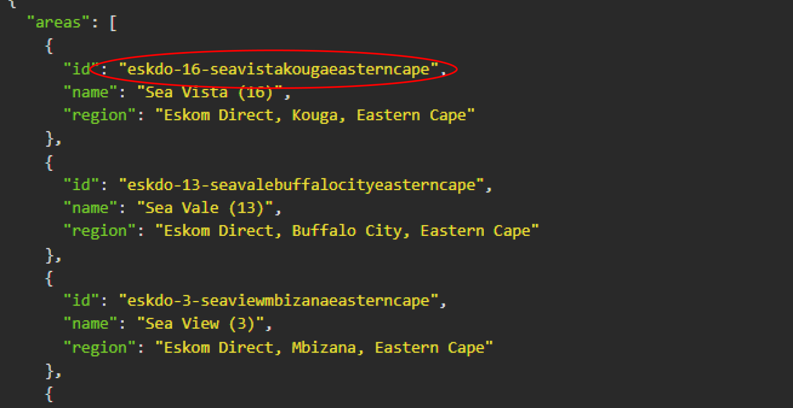

# GridGuard
A simple utility to shutdown your PC when there is loadshedding.

<!-- Repository Information & Links-->
<br />


<p align="center">
    <a href="https://github.com/xviovx/GridGuard">
        
    </a>
</p>
  <p align="center">
   <a href="https://youtu.be/eHNFI2MwSTc" align="center" align="center">View Demo</a>
    ·
    <a href="https://github.com/xviovx/Lingo_Labs/issues" align="center">Report Bug</a>
    ·
    <a href="https://github.com/xviovx/Lingo_Labs/issues" align="center">Request Feature</a>
</p>
<!-- TABLE OF CONTENTS -->

## Table of Contents

- [Description](#description)
- [Installation](#installation)
- [Setup](#setup)
  - [Running the Script](#running-the-script)
  - [Get an API Key](#get-an-api-key)
  - [Determine Your Area ID](#determine-your-area-id)
- [Important Notes](#important-notes)
- [Download](#download)
- [Contributions](#contributions)
- [Authors](#authors)

<br>

### Description

A lightweight Python script leveraging the EskomSePush API (https://esp.info/). 

### Built With

* [Python](https://www.python.org/doc/)

## Installation

1. **Ensure Python is installed:**
   - Make sure you have Python installed on your system. If not, download and install it from [Python's official website](https://www.python.org/downloads/).

2. **Clone the repository:**
   - Clone or download the Load Shedding Shutdown Utility repository to your local machine.

     ```bash
     git clone https://github.com/xviovx/GridGuard.git
     ```

3. **Navigate to the directory:**
   - Open a terminal or command prompt and change to the utility's directory.

     ```bash
     cd GridGuard
     ```

4. **Install dependencies:**
   - Run the following command to install required Python libraries.

     ```bash
     pip install -r requirements.txt
     ```

5. **Run the utility:**
   - Execute the script to set up the GUI and configure your API token and area ID.

     ```bash
     python load.py
     ```

6. **Follow the GUI instructions:**
   - Enter your API token and area ID when prompted. The utility will save these details in a `.env` file for future use.

7. **Execute the utility:**
   - Once configured, run the utility.

     ```bash
     python load.py
     ```

Now, the Load Shedding Shutdown Utility is ready to manage your computer during load shedding events. 

## Setup

1. **Running the script:**
    When you run the script for the first time, you will be prompted with the following window:

    

2. **Get an API key:**
    You will require an API key from EskomSePush. Navigate to the website to secure your key (https://eskomsepush.gumroad.com/l/api)

    

3. **Determine your area ID:**
   Use the following API endpoint to search for areas based on text:
   ```markdown
   [GET] https://developer.sepush.co.za/business/2.0/areas_search?text=<your_search_query>
    ```

    Replace <your_search_query> with a relevant keyword related to your location, such as the name of your city or neighborhood.

    In the following instance, I am using Insomnia to make a HTTP GET request:

    

    Remember to include your API key as a token in the headers.

    

    Then simply find your area and copy the ID.

    

### Important Notes

- Fetching the loadshedding schedule uses 5 requests on the free tier (you have max 50 requests every 24h); so the script has been configured to fetch the schedule every 2.5 hours. 

- When you run the script for the first time, it is added to the Windows Registry. To uninstall, press Windows key + R, type "regedit," and navigate to Computer\HKEY_CURRENT_USER\Software\Microsoft\Windows\CurrentVersion\Run

### Download

Alternatively, if you would like to just run the .exe, you can download it here:

https://www.mediafire.com/file/4t8p0zbbxaabkos/load.exe/file

## Contributions

If you'd like to contribute to improving this project, please follow these guidelines:

1. **Fork the Repository:**
   Fork this repository to your own GitHub account and clone it to your local machine.

   ```bash
   git clone https://github.com/xviovx/GridGuard.git
   ```

2. **Create a Branch:**
   Create a new branch for your contribution.

   ```bash
   git checkout -b feature/your-feature
   ```

3. **Make Changes**

4. **Commit Changes:**
   Create a new branch for your contribution.

   ```bash
   git commit -m "Add your meaningful commit message here"
   ```

5. **Push Changes:**
    Push your changes to your forked repository.

   ```bash
   git push origin feature/your-feature
   ```

6. **Open a Pull Request:**
    Open a pull request on the original repository. 

<!-- AUTHORS -->
## Authors

- **Kyle Pharoah** - [xviovx](https://github.com/xviovx)


